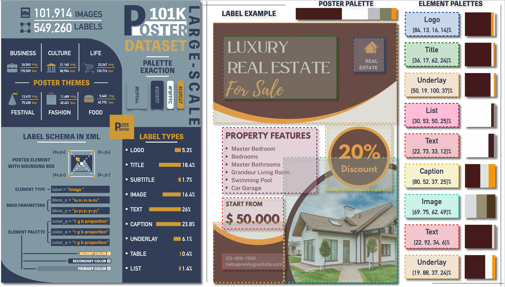

# POSTER101K: A Large-scale Poster Image Dataset for Graphic Layout Generation


[](https://www.kaggle.com/datasets/flylyisflying93/poster101k/)

  

**Poster101K** is a large-scale image dataset of posters, originally created as a benchmark for graphic layout generation models. It includes 101,914 poster images covering six themes and 549,260 bounding boxes annotating nine types of design elements. It offers a significant advantage in scale and provides information on new design elements. The poster images were collected using [Eagle](https://cn.eagle.cool/) from [Pinterest](https://au.pinterest.com/), [Canvas](https://www.canva.cn/), [Fotor](https://www.fotor.com.cn/), [Freepik](https://https://wepik.com//), and [Gaoding](https://www.gaoding.com/). All poster images were manually annotated by [Label Studio](https://labelstud.io/). Only posters under permissive licenses were collected. All color palettes are extracted by [Pylette](https://doi.org/10.5281/zenodo.14757253). We evaluate the color aesthetics of Poster101K by using the [Image Color Aesthetics Assessment (ICAA)](https://github.com/woshidandan/Image-Color-Aesthetics-and-Quality-Assessment) method, trained initially on the ICAA17K photography dataset.

.jpg)  

We tested four baseline models in six graphic layout-related generation tasks (shown in the figure above) with our dataset and three existing datasets to evaluate the value and potential of our dataset. Experimental results show the advantage of our dataset over the existing layout datasets (e.g. [Rico](http://www.interactionmining.org/rico.html), [PubLayNet](https://github.com/ibm-aur-nlp/PubLayNet), and [MagLayout](https://xtqiao.com/projects/content_aware_layout/)). Our dataset provides an important resource for model training and evaluation methods in the graphic layout field.

## 📎 Supplementary materials for ACM MM 25' Dataset Track
**Supplementary materials for ACM MM 25' Dataset Track** are shown in [Appendix](./Appendix_POSTER101K_ACM_MM_2025_DATASET_TRACK.pdf).


## 📥 Download
This repository does not store data files directly. Please obtain them through the following methods:
- Recommended download source (Kaggle)：[Kaggle](https://www.kaggle.com/datasets/flylyisflying93/poster101k/)
- Alternative download sources：[Baidu Netdisk](https://pan.baidu.com/s/1p3bDj4suiawCB5ZA6sNGhQ?pwd=d8m3) (Access Code: d8m3)

## 🚀 Quick Start
### Download through Kaggle API：
```bash
#!/bin/bash
kaggle datasets download flylyisflying93/poster101k
```

### Data loading example（Python）：
```python
# Install dependencies as needed:
# pip install kagglehub[pandas-datasets]
import kagglehub
from kagglehub import KaggleDatasetAdapter

# Set the path to the file you'd like to load
file_path = ""

# Load the latest version
df = kagglehub.load_dataset(
  KaggleDatasetAdapter.PANDAS,
  "flylyisflying93/poster101k",
  file_path,
  # Provide any additional arguments like 
  # sql_query or pandas_kwargs. See the 
  # documenation for more information:
  # https://github.com/Kaggle/kagglehub/blob/main/README.md#kaggledatasetadapterpandas
)

print("First 5 records:", df.head())
```

## 🗂️ Dataset Structure
```
Poster101K/
├── images/                                      # Poster Images
│   ├──Business/                                 # Theme name
│   │   ├── 1                                    # Subfolder for number grouping (total 1000 images per folder)
│   │   │   ├── Business_1.png                   # Format: JPG, PNG, WEBP
│   │   │   └── ...
│   │   └── ...
│   ├──Culture/
│   ├──Fashion/
│   ├──Festival/
│   ├──Food/
│   └──Life/                                     # Total 101,914 images
└── annotations/                                 # Annotation files
    ├──Business_annotation/ 
    │    └── xml
    │	  ├── Business_1.xml                   # Layout data in XML format
    │	  └── ...                              # One-to-one correspondence with poster images
    ├──Culture_annotation/ 
    ├──Fashion_annotation/ 
    ├──Festival_annotation/ 
    ├──Food_annotation/ 
    └──Life_annotation/ 

```

## 📝 Annotation Metadata
Every XML file includes：
```xml
<annotation>
  <filename>Business_1</filename>
  <category>Business</category>
  <size>
    <width>1000</width>
    <height>1779</height>
  </size>
  <palette> //Color palette of the entire poster
    <color rgb_p="14 29 36 0.35" />
    <color rgb_p="221 225 224 0.28" />
    <color rgb_p="170 185 177 0.19" />
    <color rgb_p="134 119 109 0.097" />
    <color rgb_p="19 105 95 0.09" />
  </palette>
  <layout> //Layout information of each design element
    <element label="Logo" polygon_x="59 297 297 59 59" polygon_y="60 60 147 147 60" color_1="205 219 213 0.53" color_2="149 181 173 0.25" color_3="18 97 83 0.22" />
    <element label="Logo" polygon_x="333 595 595 333 333" polygon_y="51 51 159 159 51" color_1="230 233 235 0.64" color_2="182 207 201 0.19" color_3="21 98 85 0.16" />
    <element label="Title" polygon_x="77 420 420 77 77" polygon_y="1044 1044 1209 1209 1044" color_1="9 22 29 0.74" color_2="245 163 174 0.21" color_3="129 94 103 0.044" />
    <element label="Title" polygon_x="68 542 542 68 68" polygon_y="1259 1259 1374 1374 1259" color_1="9 18 25 0.79" color_2="238 240 241 0.14" color_3="119 125 128 0.064" />
    <element label="Subtitle" polygon_x="79 304 304 79 79" polygon_y="1396 1396 1471 1471 1396" color_1="7 14 20 0.77" color_2="240 241 242 0.17" color_3="121 125 128 0.058" />
    <element label="Caption" polygon_x="75 553 553 75 75" polygon_y="1524 1524 1587 1587 1524" color_1="10 16 23 0.61" color_2="242 172 185 0.35" color_3="119 89 99 0.042" />
    <element label="Text" polygon_x="51 253 253 51 51" polygon_y="453 453 498 498 453" color_1="205 219 211 0.46" color_2="153 181 172 0.42" color_3="54 112 98 0.12" />
    <element label="Text" polygon_x="51 158 158 51 51" polygon_y="577 577 771 771 577" color_1="162 190 183 0.58" color_2="197 217 209 0.29" color_3="45 109 95 0.13" />
  </layout>
</annotation>
```

## 👍 Acknowledgements
We thank Qiuyang Yuan and Liying Wang for in-depth discussions and helpful poster labelling. We also thank Shuigeng Zhou for careful and patient guidance.

## 🤝 Feedback
Suggestions and opinions on this dataset (both positive and negative) are welcomed. Please contact the author by sending an email to wangf21@m.fudan.edu.cn.

## 📜 License and Copyright
This dataset is open source under [CC BY 4.0](LICENSE) license. For commercial purposes, please contact Dr. Fei Wang at wangf21@m.fudan.edu.cn or Prof. Shuigeng Zhou at sgzhou@fudan.edu.cn.
```bibtex
@dataset{poster101k,
  author = {Fei Wang},
  year = {2025},
  title = {Poster101k: A Large-scale Poster Image Dataset for Graphic Layout Generation},
  publisher = {Kaggle},
  version = {1.0},
  url = {https://www.kaggle.com/datasets/flylyisflying93/poster101k/}
}
```

© Shanghai Key Lab of Intelligent Information Processing, and School of Computer Science, Fudan University.
